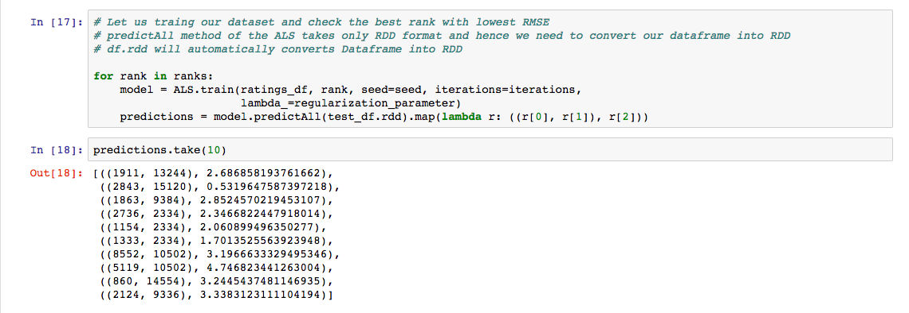

# MovieRatingPredictor

Movie Rating Predictor System using technologies:

• ALS(Matrix Factorization)  
• PySpark  

Features: 

• Model creation on training data 
• Model predicts the unknown ratings

Steps to run the application:
1. Open the terminal
2. Enter the startup folder
3. Type "jupyter notebook" to launch and run

Below are some screenshots demonstrating the application:

### Showing the sample for predictions

